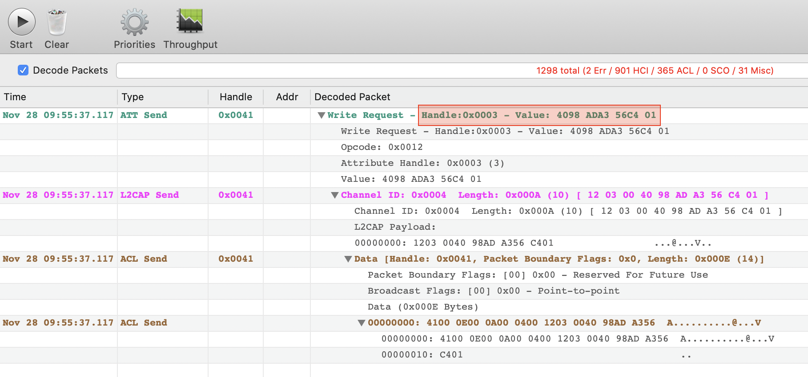

# Homebridge UE Boom speaker plugin

[](https://opensource.org/licenses/MIT)

This is an accessory plugin for [Homebridge](https://github.com/nfarina/homebridge) allowing to turn on and off a UE Boom speaker and integrating it with [HomeKit](https://www.apple.com/ios/home/).

**Turning off the speaker is not yet possible as it requires `rfcomm` and I've been having some issues with it. As soon as I have time I'll work on it.**

## Installation

### Homebridge

First, install [Homebridge](https://github.com/nfarina/homebridge) and `gatttool` via [Bluez](http://www.bluez.org) (you also need [Node.js](https://nodejs.org/) installed):

```bash
sudo npm install -g homebridge
sudo apt-get install bluez
```

Then install this plugin:

```bash
sudo npm install -g homebridge-ueboom
```

### Homebridge Docker

In case you're using [Homebridge Docker](https://github.com/oznu/docker-homebridge), add the following line to your container startup script:

```bash
apk add --no-cache bluez-deprecated
```

Then install this plugin:

```bash
sudo npm install -g homebridge-ueboom
```

## Find out the MAC address

To get the plugin working you have to provide the following parameters:

  * `mac`: MAC address of the speaker

In case you don't know how to retrieve the MAC address of the speaker:

 1. Pair the speaker to your MacBook
 2. Click on Bluetooth icon in the Menu Bar while pressing `⌥ Option`
 3. Select the speaker of which you need the address
 4. Write down the MAC address

## Configuration

Create a [`~/.homebridge/config.json`](https://github.com/nfarina/homebridge/blob/master/config-sample.json) file (change `name` and `mac` as necessary):


```json
{
  "bridge": {
    "name": "Homebridge",
    "username": "E5:B9:0D:64:1E:CB",
    "port": 51826,
    "pin": "031-45-154"
  },
  "description": "This is an example configuration file with homebridge-ueboom plugin.",
  "accessories": [
    {
      "accessory": "UEBoomSpeaker",
      "name": "Bathroom Speaker",
      "mac": "CA:38:93:3B:D8:5D"
    }
  ],
  "platforms": []
}
```

## How does it work

Since more than one person asked me how this works and that the speaker doesn't connect to the Pi after being turned on, I thought I could spend a couple of words about.

This is the command that does the whole work, everything else is just boilerplate code for the homebridge plugin:

`gatttool -i hci0 -b $MAC_ADDRESS --char-write-req -a 0x0003 -n 4098ADA356C401`

**The `gatttool` command turns the speaker on but doesn’t associate the speaker with the Raspberry Pi. The speaker connects to the latest paired device (in my case my iPhone).**

I don't know the exact specifications so this is pure speculation: the speaker itself has the usual Bluetooth 4.0 module that allows to stream music, in addition to that there's also a BLE (Bluetooth Low Energy) module that for its own nature is always on and allows to turn the speaker on and off remotely (within range). The only reason why I'm not sure this is the real reason is that the two modules would probably have two separate MAC addresses, and from what I've observed there's only one single address available.

## How I did it

I knew that the speaker could be turned on remotely (within range) using the proprietary [Ultimate Ears app](https://apps.apple.com/us/app/boom-megaboom/id632344648), and it was obvious that the bluetooth command was sent by the application itself.

I first installed Apple's [Bluetooth logging profile](https://developer.apple.com/services-account/download?path=/iOS/iOS_Logs/iOSBluetoothLogging.mobileconfig) on my iPhone, then connected it to the Mac via USB and used [PacketLogger](https://download.developer.apple.com/Developer_Tools/Additional_Tools_for_Xcode_11/Additional_Tools_for_Xcode_11.dmg) to trace the packages sent from the phone (specifically `ATT Send` type). By opening the UE app and tapping on the remote power button in it I was able to *sniff* the conversation between the phone and the speaker as shown in this screenshot.



From here I retrived the MAC address of the speaker (as described above) and used `gatttool` to perform a write request, and *BOOM* I can turn on the speaker from my command line.